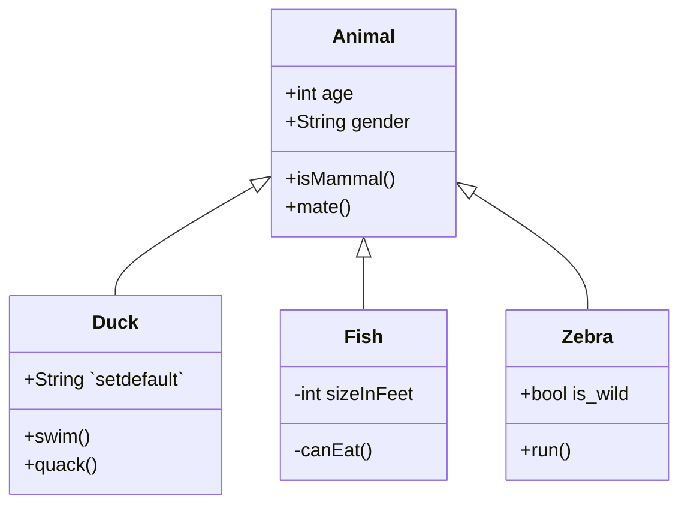

 

 

 

 

<!--MERMAID {width:100}-->

<!--MCONTENT {content: "classDiagram \nAnimal <|-- Duck \nAnimal <|-- Fish \nAnimal <|-- Zebra \nAnimal : +int age \nAnimal : +String gender \nAnimal: +isMammal() \nAnimal: +mate() \nclass Duck{ \n+String `setdefault`<swm-token data-swm-token=\":src/flask/sessions.py:85:3:3:`    def setdefault(self, key: str, default: t.Any = None) -&gt; t.Any:`\"/> \n+swim() \n+quack() \n} \nclass Fish{ \n\\-int sizeInFeet \n\\-canEat() \n} \nclass Zebra{ \n+bool is\\_wild \n+run() \n} \n\n "} --->

 

This file was generated by Swimm. [Click here to view it in the app](http://localhost:5000/repos/Z2l0aHViJTNBJTNBZmxhc2slM0ElM0FuYWRhdi1zd2ltbQ==/docs/bf5k9).
