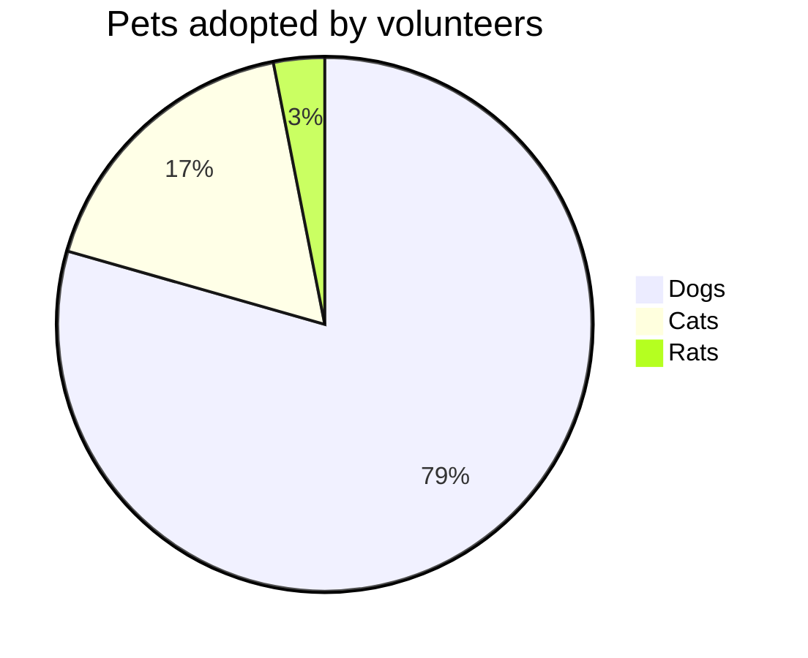

"Smart Tokens" refers to either **tokens** or **paths** that are being tracked and synced. They help you keep your documentation up to date by allowing you to reference parts of your code. The most common use is referencing **variable**, **method**, or **function** names within the document.

## Example

> We have created a `Template`<swm-token data-swm-token="dummy-repo:examples/vanilla-es6/src/template.js:5:6:6:`export default class Template {`"/> _class_ to handle the main view that renders the contents. 
> Our `View`<swm-token data-swm-token="dummy-repo:examples/vanilla-es6/src/view.js:9:6:6:`export default class View {`"/> _class_ emulates the rendering of a `Template`<swm-token data-swm-token="dummy-repo:examples/vanilla-es6/src/template.js:5:6:6:`export default class Template {`"/> and tracking the responsiveness. 
> The state of our app is managed by our own created `Store`<swm-token data-swm-token="dummy-repo:examples/vanilla-es6/src/store.js:3:6:6:`export default class Store {`"/>

 

<!--MERMAID {width:100}-->

<!--MCONTENT {content: "pie title Pets adopted by volunteers \n\"Dogs\" : 386 \n\"Cats\" : 85 \n\"Rats\" : 15\n\n "} --->

 

## Try it yourself!

1.  Create a new doc (or edit existing one)

2.  Type a backtick \` and look for a class, function, or variable.

 

 

 

 

This file was generated by Swimm. [Click here to view it in the app](https://app.swimm.io/repos/Z2l0aHViJTNBJTNBZmxhc2slM0ElM0FuYWRhdi1zd2ltbQ==/docs/uyq4dwc4).
