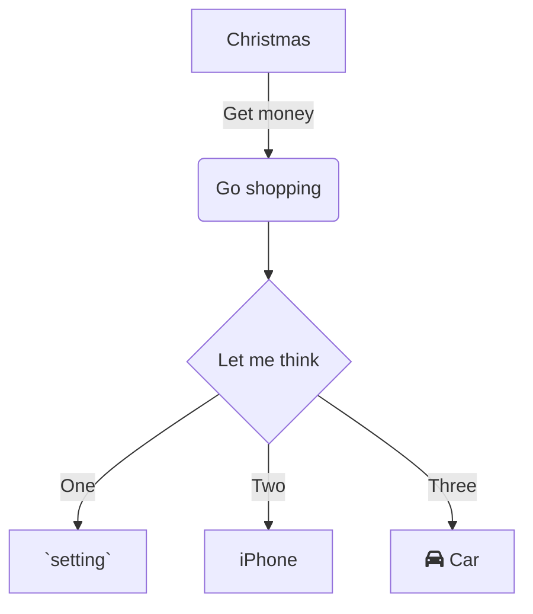

<br/>

`install`<swm-token data-swm-token=":.readthedocs.yaml:7:1:1:`  install:`"/>

<br/>


<!-- NOTE-swimm-snippet: the lines below link your snippet to Swimm -->
### 📄 .readthedocs.yaml
```yaml
4        tools:
5          python: "3.10"
6      python:
7        install:
8          - requirements: requirements/docs.txt
9          - method: pip
10           path: .
11     sphinx:
12       builder: dirhtml
13       fail_on_warning: true
```

<br/>

`📄 requirements`

`📄 .readthedocs.yaml`

`setdefault`<swm-token data-swm-token=":src/flask/ctx.py:87:3:3:`    def setdefault(self, name: str, default: t.Any = None) -&gt; t.Any:`"/>

<br/>


<!-- NOTE-swimm-snippet: the lines below link your snippet to Swimm -->
### 📄 setup.cfg
```ini
14     author = Armin Ronacher
15     author_email = armin.ronacher@active-4.com
16     maintainer = Pallets
17     maintainer_email = contact@palletsprojects.com
```

<br/>

<!--MERMAID {width:100}-->

<!--MCONTENT {content: "graph TD<br/>\nA\\[Christmas\\] \\-\\-\\>|Get money| B(Go shopping)<br/>\nB \\-\\-\\> C{Let me think}<br/>\nC \\-\\-\\>|One| D\\[`setting`<swm-token data-swm-token=\":src/flask/ctx.py:296:24:24:`    that did not fail and outside of ``DEBUG`` mode.  By setting`\"/>\\]<br/>\nC \\-\\-\\>|Two| E\\[iPhone\\]<br/>\nC \\-\\-\\>|Three| F\\[fa:fa-car Car\\]<br/>\n\n<br/>"} --->

<br/>

This file was generated by Swimm. [Click here to view it in the app](https://swimm-web-app.web.app/repos/Z2l0aHViJTNBJTNBZmxhc2slM0ElM0FuYWRhdi1zd2ltbQ==/docs/8xe19).
