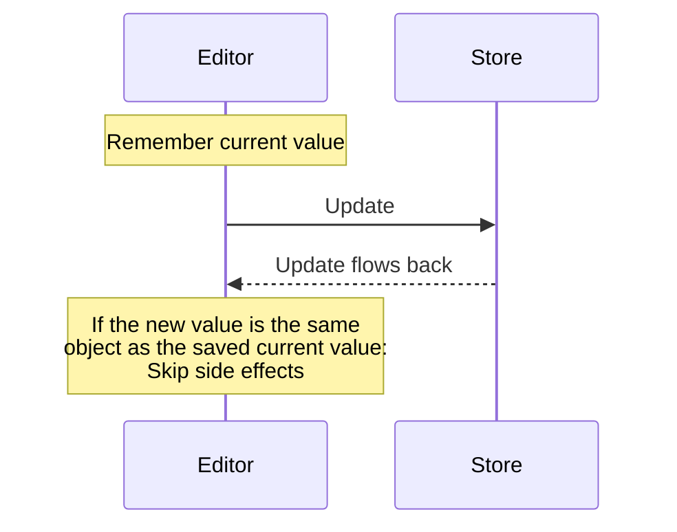

 

 

<!--MERMAID {width:100}-->

<!--MCONTENT {content: "sequenceDiagram \nnote over Editor: Remember current value \nEditor ->> Store: Update \nStore \\-\\-\\>> Editor: Update flows back \nnote over Editor: If the new value is the same  object as the saved current value:  Skip side effects"} --->

 

This file was generated by Swimm. [Click here to view it in the app](https://app.swimm.io/repos/Z2l0aHViJTNBJTNBZmxhc2slM0ElM0FuYWRhdi1zd2ltbQ==/docs/n8jy1tvt).
